# TicketShowIITM App

Welcome to the TicketShowIITM app! This document will guide you through the steps to set up and run the app on your local machine.

## Backend Setup

1. Unzip the downloaded folder.

2. Navigate to the `backend` folder using your terminal.

3. Create a virtual Python environment (optional but recommended):

```
python3 -m venv venv
```

4. Install the backend dependencies:

```
pip install -r requirements.txt
```

5. Start the backend server:

```
python3 app.py
```

The backend server will be running at https://showscape-backend.onrender.com.

## Frontend Setup

1. Open a new terminal.

2. Navigate to the `frontend/ticketshowiitm` folder.

3. Install frontend dependencies:

```
npm install
```

4. Start the frontend server:

```
npm run serve
```

The frontend server will be running at http://localhost:8080.

## Setting Up Stripe Webhook

1. Download and install ngrok from https://ngrok.com.

2. Open a new terminal and run ngrok to create a forwarding URL:

```
ngrok http 5000
```

3. Copy the forwarding URL (e.g., https://abc123.ngrok.io).

4. Create a Stripe account, go to the Developers section, and turn on test mode.

5. In the Stripe Dashboard, navigate to Webhooks and add a new endpoint:

- Endpoint URL: `<ngrok-forwarding-url>/api/webhooks/stripe`
- Events to send: `checkout.session.completed`

6. Once the endpoint is ready to accept events, you can start using the app.

## Starting the App

1. With the backend and frontend servers running, open your browser.

2. Go to http://localhost:8080 to access the TicketShowIITM app.

Enjoy using the TicketShowIITM app for managing theater shows and bookings!

## Screenshots

Here are some screenshots of the TicketShowIITM app:

1. Sign Up Page
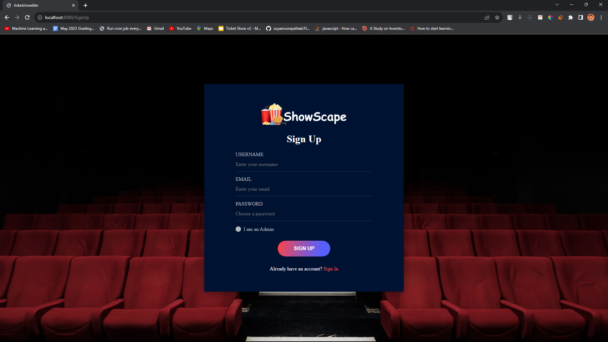

2. Sign In Page
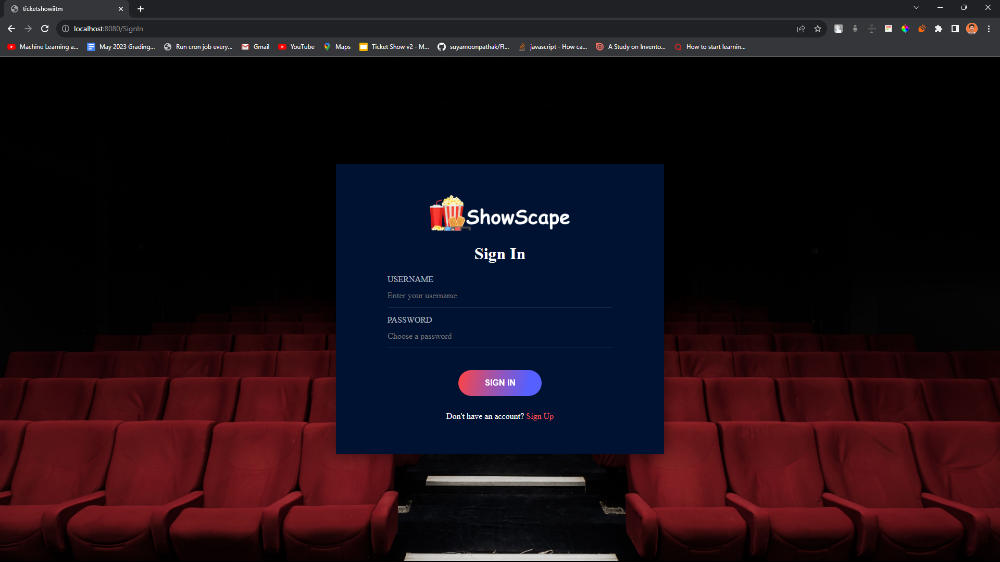

3. User Dashboard
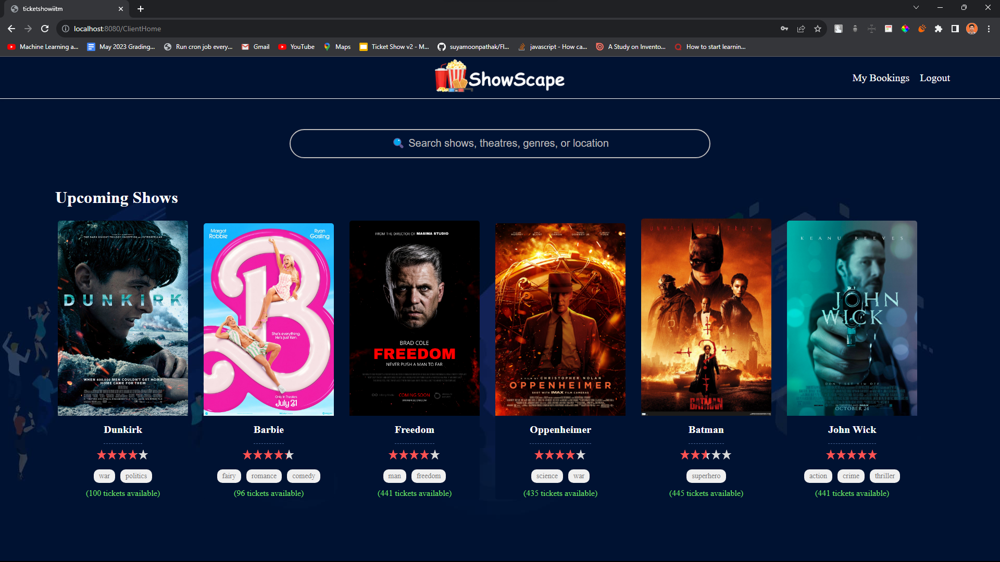

4. Show Details
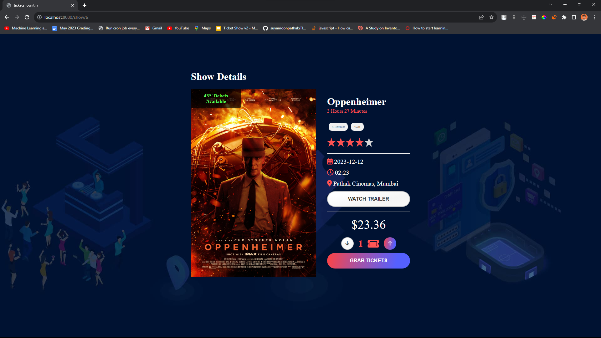

5. Search Feature
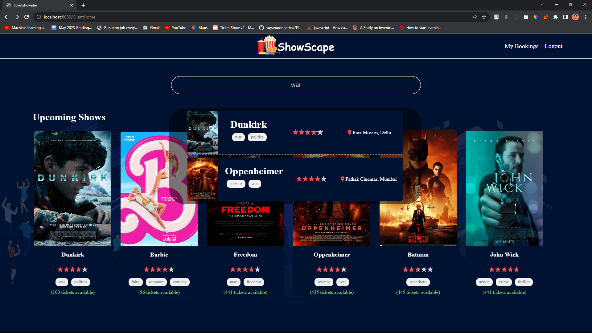

6. User Bookings
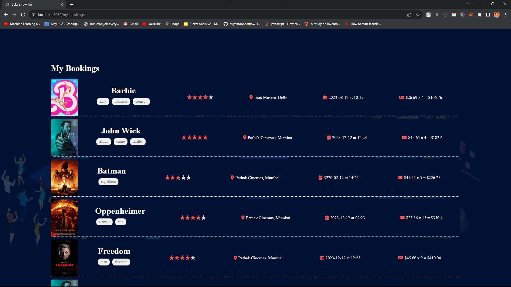

7. User Monthly Entertainment Report Email
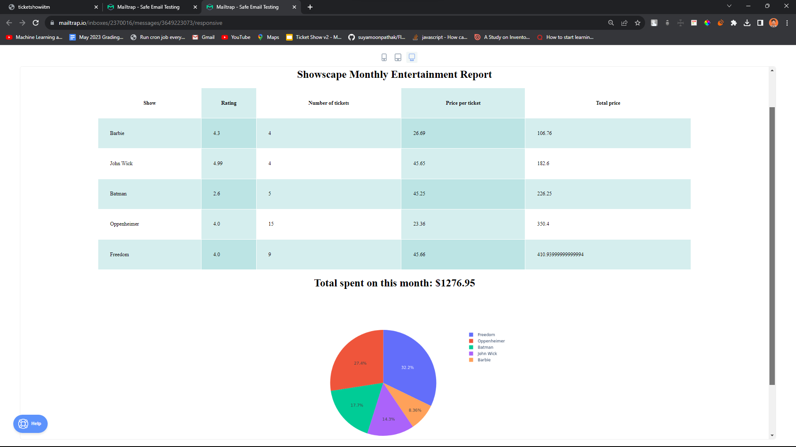

8. User Reminder Email
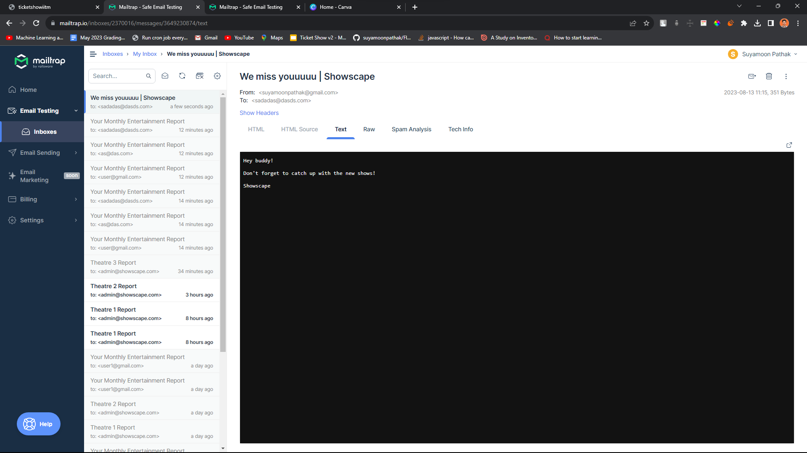

9. Create Theatre
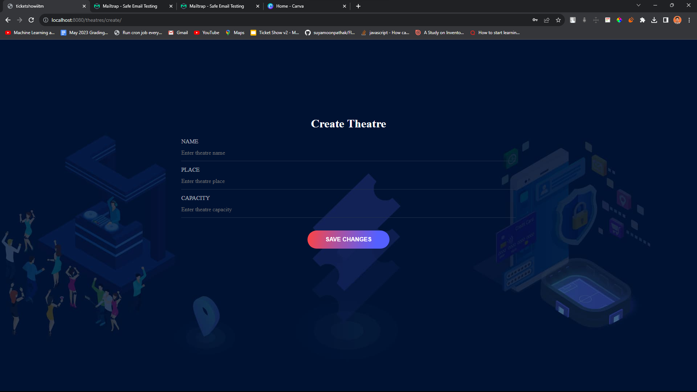

9. Create Show
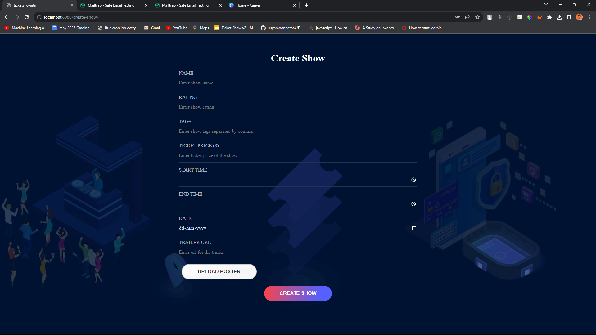

9. Edit Theatre
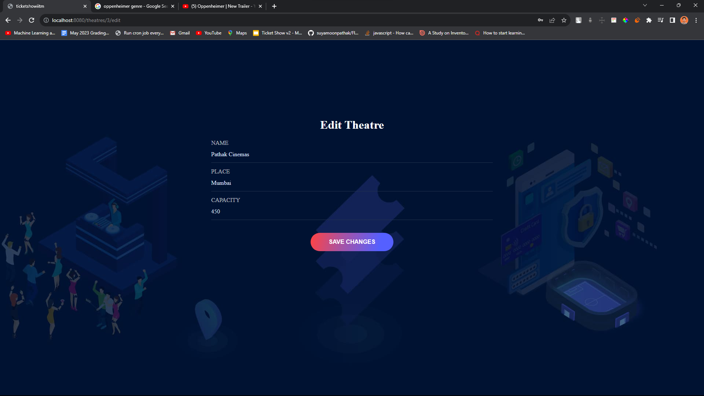

9. Edit Show


10. Theatre Summary
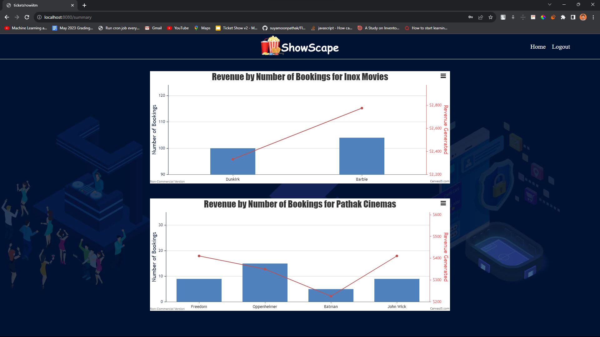

11. Theatre Report CSV in Email
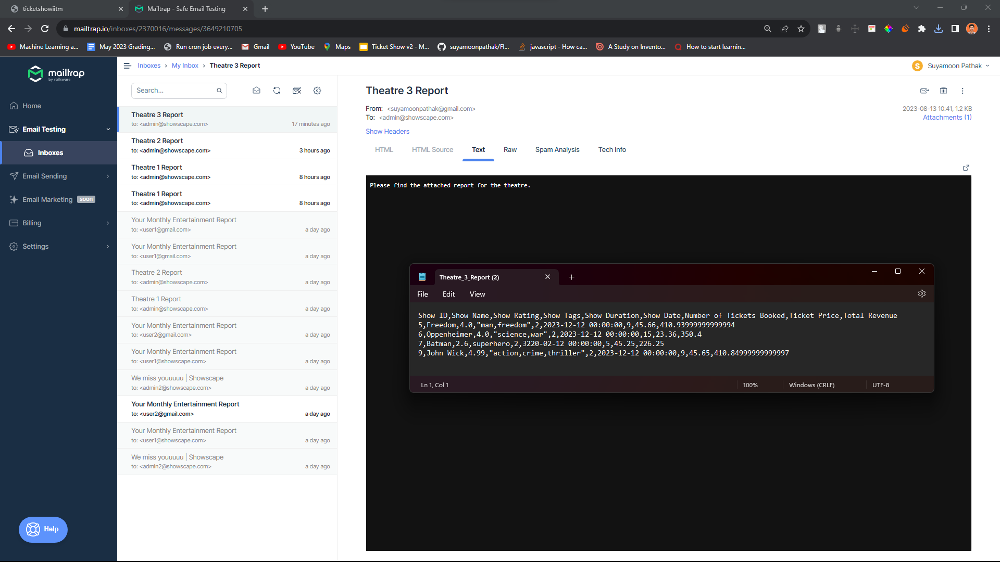